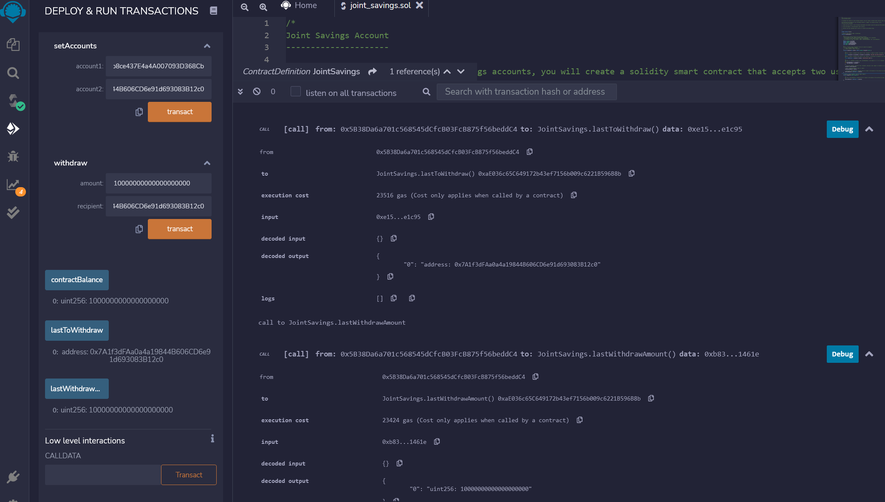

[Technologies](#Technologies) | [Installation](#installation-guide) | [Usage](#usage) | [Screenshots](#screenshots) | [Contributors](#contributors) | [License](#license)

# joint_savings
This is a blockchain-based smart contract to automate the creation of joint savings accounts, using ether management functions to implement a financial institution’s requirements for providing the features of the joint savings account. The Smart contract is deployed using Remix and Solidity by integrating the Ethereum blockchain network into the application. It accepts two user addresses to control a joint savings account with the features to deposit and withdraw funds from the account. 

## Technologies

This project leverages python 3.7 with the following packages / IDEs:

* [Visual Studio Code](https://code.visualstudio.com/?wt.mc_id=DX_841432) - Visual Studio Code is a lightweight but powerful source code editor which runs on your desktop and is available for Windows, macOS and Linux. 

* [Ganache](https://trufflesuite.com/ganache/) - A program that allows you to quickly set up a local blockchain, which you can use to test and develop smart contracts. 

* [mnemonic](https://pypi.org/project/mnemonic/) - A Python implementation for generating a 12- or 24-word mnemonic seed phrase based on the BIP-39 standard.

* [REMIX IDE](https://remix-project.org/) - Remix IDE allows developing, deploying and administering smart contracts for Ethereum like blockchains.

* [Solidity](https://docs.soliditylang.org/en/v0.8.14/) - Solidity is an object-oriented, high-level language for implementing smart contracts. Smart contracts are programs which govern the behaviour of accounts within the Ethereum state.


---

## Installation Guide

You will need Solidity version 0.5.0 or above and gitbash/terminal on your computer, along with other supporting packages as mentioned below. 

Please follow instructions from the below link to install python 3.7 or above on your computer

[To install Python, follow instructions from this link](https://www.python.org/downloads/)

[To install Git Bash, follow instructions from this link](https://github.com/git-guides/install-git)

[To install Anaconda, follow instructions from this link ](https://docs.anaconda.com/anaconda/install/)

[To install Visual Studio Code, follow instructions from this link ](https://code.visualstudio.com/docs/setup/setup-overview)

[To install Ganache, follow instructions from this link to download and install ](https://trufflesuite.com/ganache/)

[To install Microsoft Visual C++ Build Tools in Windows(dependency for Web3.py in windows), follow instructions below](https://visualstudio.microsoft.com/downloads/)

    * [Go to](https://visualstudio.microsoft.com/downloads/)
    * Scroll down the page, and then click "Tools for Visual Studio 2019" to reveal the options.
    * Download the "Build Tools for Visual Studio 2019" package.
    * Run the package file and select the C++ Build Tools option. Then click Install. The installation process takes about 15 minutes.


```python
# install conda dev environment and activate it
    conda update conda
    conda create -n dev python=3.7 anaconda
    conda activate dev

# Install Web3.py library (Optional)
    conda activate dev
    pip install web3==5.17

# Install ethereum-tester library (Optional)
    conda activate dev
    pip install eth-tester==0.5.0b3

# Install mnemonic package (Optional)
    conda activate dev
    pip install mnemonic

# Install bip44 package (Optional)
    conda activate dev
    pip install bip44


```

---


## Usage

[Use this Simple Unit Converter for converstion between Ether, Gwei or Wei](https://eth-converter.com/)

To use the Joint Savings Smart Contract, clone the repository and run the above commands in gitbash as applicable,

```git
git clone https://github.com/sidbetatester/joint_savings.git

cd joint_savings

# 2. To launch the Remix web IDE, use the following link in the browser

https://remix.ethereum.org/

# 3. On the resulting webpage, Create the .sol file for joint_savings that you downloaded from github)

# 4. Use 0.5.0 or above Solidity Compiler, click Compile

# 5. In the Deploy & Run Transactions Section, choose 'JavaScript VM' environment, and click 'Deploy'

```
   
## Screenshots

### Screenshot of Step 2: Compile and Deploy Your Contract in the JavaScript VM:


### Screenshot of Step 3.1: Use the setAccounts function to define the authorized Ethereum address that will be able to withdraw funds from your contract:
   
    Dummy account1 address: 0x0c0669Cd5e60a6F4b8ce437E4a4A007093D368Cb
    Dummy account2 address: 0x7A1f3dFAa0a4a19844B606CD6e91d693083B12c0


### Screenshot of Step 3.2: Test the deposit functionality of your smart contract by sending the following amounts of ether. After each transaction, use the contractBalance function to verify that the funds were added to your contract:
    
    Screenshot of Step 3.2: Transaction 1: Send 1 ether as wei.


    Screenshot of Step 3.2: Transaction 2: Send 10 ether as wei.


    Screenshot of Step 3.2: Transaction 3: Send 5 ether.


### Screenshot of Step 3.3: Once successfully deposited funds into the contract, test the contract’s withdrawal functionality by withdrawing 5 ether into accountOne and 10 ether into accountTwo. After each transaction, use the contractBalance function to verify that the funds were withdrawn from your contract. Also, use the lastToWithdraw and lastWithdrawAmount functions to verify that the address and amount were correct.





## Contributors

Siddharth Venkumahanti
[linkedin](https://www.linkedin.com/in/siddharthvenkumahanti/)


---


## License

### MIT License

Copyright (c) [2022] [Siddharth Venkumahanti]

Permission is hereby granted, free of charge, to any person obtaining a copy
of this software and associated documentation files (the "Software"), to deal
in the Software without restriction, including without limitation the rights
to use, copy, modify, merge, publish, distribute, sublicense, and/or sell
copies of the Software, and to permit persons to whom the Software is
furnished to do so, subject to the following conditions:

The above copyright notice and this permission notice shall be included in all
copies or substantial portions of the Software.

THE SOFTWARE IS PROVIDED "AS IS", WITHOUT WARRANTY OF ANY KIND, EXPRESS OR
IMPLIED, INCLUDING BUT NOT LIMITED TO THE WARRANTIES OF MERCHANTABILITY,
FITNESS FOR A PARTICULAR PURPOSE AND NONINFRINGEMENT. IN NO EVENT SHALL THE
AUTHORS OR COPYRIGHT HOLDERS BE LIABLE FOR ANY CLAIM, DAMAGES OR OTHER
LIABILITY, WHETHER IN AN ACTION OF CONTRACT, TORT OR OTHERWISE, ARISING FROM,
OUT OF OR IN CONNECTION WITH THE SOFTWARE OR THE USE OR OTHER DEALINGS IN THE
SOFTWARE.


